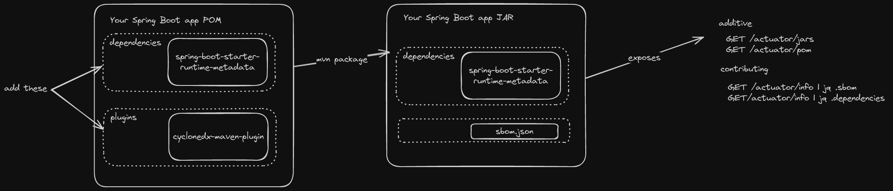

# Spring Boot Starter Runtime Metadata

[](https://img.shields.io/badge/Release-Alpha-orange)  [](https://snyk.io/test/github/cf-toolsuite/spring-boot-starter-runtime-metadata) [](https://jitpack.io/#cf-toolsuite/spring-boot-starter-runtime-metadata/master-SNAPSHOT) [](https://opensource.org/licenses/Apache-2.0)



This starter aims to provide a few custom actuator endpoints:

* GET `/actuator/jars` will list the dependent `.jar` files embedded in a Spring Boot application
* GET `/actuator/pom` will emit the contents of the `pom.xml` file (if the application was built with Maven)
* GET `actuator/info` enhanced to provide
  * a CycloneDX SBOM in JSON format (only if the application packages an sbom.json)
  * just the list of dependencies in JSON format (again only if the application packages an sbom.json)


## Background

The thinking goes, most developers want to deploy apps to an "app-aware" platform.  How might a Spring Boot application register itself and its dependencies with the platform?  As well, provide information at runtime about its dependencies.

The first target is Cloud Foundry.  But there's nothing that stops us from doing the same on other target runtime platforms (e.g. Kubernetes).


## Prerequisites

* [SDKMan](https://sdkman.io/)
* JDK 17 or better
* (Optionally) access to a [Cloud Foundry](https://www.cloudfoundry.org/) foundation with read-only admin credentials


## Clone

```
gh repo clone cf-toolsuite/spring-boot-starter-runtime-metadata
```


## Build

```
sdk install java 17.0.10-librca
sdk use java 17.0.10-librca
./mvnw clean install
```


## How to use

### Maven

Add the following `dependency` to your application's `pom.xml` file

```
<dependency>
  <groupId>org.cftoolsuite.actuator</groupId>
  <artifactId>spring-boot-starter-runtime-metadata</artifactId>
  <version>0.2.0</version>
</dependency>
```

If you want to embed and expose a bill of materials from your artifact, then you'll also want to add this `plugin` to your application's `pom.xml` file too

```
<plugin>
  <groupId>org.cyclonedx</groupId>
  <artifactId>cyclonedx-maven-plugin</artifactId>
  <version>2.8.0</version>
  <executions>
    <execution>
      <phase>validate</phase>
      <goals>
        <goal>makeAggregateBom</goal>
      </goals>
    </execution>
  </executions>
  <configuration>
    <outputFormat>json</outputFormat>
    <outputName>classes/bom</outputName>
  </configuration>
</plugin>
```

### Gradle

Add the following `dependency` to your application's `build.gradle` file

```
dependencies {
    compile group: 'org.cftoolsuite.actuator', name: 'spring-boot-starter-runtime-metadata', version: '0.2.0'
}
```

If you want to embed and expose a bill of materials from your artifact, then you'll also want to add this `plugin` to your application's `build.gradle` file too

```
plugins {
  id 'org.cyclonedx.bom' version '1.8.2'
}

tasks.named("cyclonedxBom") {
  destination = file("${buildDir}/classes/cyclonedx")
}
```

### Cloud Native Buildpacks

If you use the [pack](https://buildpacks.io/docs/for-app-developers/how-to/build-inputs/) CLI to assemble a container image, then you're probably saying to yourself: "I don't need to add a plugin to my build configuration because `pack` will write bill of materials files in various formats to a specific layer that I can later download a copy from".

So, you build your app from source with:

```
pack build {owner/your-app-name} --path {/path/to/your/app/source} --builder paketobuildpacks/builder-jammy-full
```
> Replace `{owner/your-app-name}` and `{/path/to/your/app/source}` with the owner/name of your application and the path to source (i.e., where your build file is) respectively

Verify your image includes bill of materials files in various formats by following these [instructions](https://buildpacks.io/docs/for-app-developers/how-to/build-outputs/download-sbom/).

Among several sub-directories underneath the `layers/sbom/launch` directory, you find:

```
+- paketo-buildpacks_executable-jar
  +- sbom.cdx.json
  +- sbom.syft.json
```

Unfortunately, these files are not available and accessible in the container image at runtime.  But what you can do is make a copy of the `sbom.cdx.json` file, like so:

```
cp -f layers/sbom/launch/paketo-buildpacks_executable-jar/sbom.cdx.json src/main/resources/sbom.json
```

Then rebuild the container image.  (Remember to repeat this process for any change you make to source).

### Spring Boot application.yml

Then make sure to enable the additional contributions to the `management.info` endpoint

```
management:
  info:
    dependencies:
      enabled: true
    sbom:
      enabled: true
```

And if you want to expose the `/actuator/info`, `/actuator/jars` and `/actuator/pom` endpoints, you'll need to add (e.g., in application.yml)

```
  endpoints:
    web:
      exposure:
        include: "info,jars,pom"
```
> where `endpoints` above is a sibling of (shares the same indentation as) `info`

Build your application, then start it up.

Visit the above-mentioned custom [actuator endpoints](https://docs.spring.io/spring-boot/docs/current/reference/html/actuator.html).


## Endpoints

So what do you get when you've plumbed everything correctly?

```
GET /actuator/jars
```

```
❯ http :8080/actuator/jars
HTTP/1.1 200 OK
Content-Length: 5438
Content-Type: application/vnd.spring-boot.actuator.v3+json

[
    "BOOT-INF/lib/lombok-1.18.30.jar",
    "BOOT-INF/lib/jakarta.validation-api-3.0.2.jar",
    "BOOT-INF/lib/commons-lang3-3.14.0.jar",
    "BOOT-INF/lib/jackson-datatype-jsr310-2.16.1.jar",
    "BOOT-INF/lib/jackson-annotations-2.16.1.jar",
    "BOOT-INF/lib/jackson-core-2.16.1.jar",
    "BOOT-INF/lib/jackson-databind-2.16.1.jar",
    "BOOT-INF/lib/jackson-dataformat-csv-2.16.1.jar",
    "BOOT-INF/lib/java-uuid-generator-5.0.0.jar",
    "BOOT-INF/lib/slf4j-api-2.0.12.jar",
    "BOOT-INF/lib/java-cfenv-boot-3.1.5.jar",
    "BOOT-INF/lib/java-cfenv-3.1.3.jar",
    "BOOT-INF/lib/java-cfenv-jdbc-3.1.5.jar",
    "BOOT-INF/lib/spring-boot-3.2.3.jar",
    "BOOT-INF/lib/spring-context-6.1.4.jar",
    "BOOT-INF/lib/spring-aop-6.1.4.jar",
    "BOOT-INF/lib/spring-expression-6.1.4.jar",
    "BOOT-INF/lib/json-io-4.19.1.jar",
    ...
```

```
GET /actuator/pom
```

```
❯ http :8080/actuator/pom
HTTP/1.1 200 OK
Content-Length: 28052
Content-Type: application/vnd.spring-boot.actuator.v3+json;charset=UTF-8

<?xml version="1.0" encoding="UTF-8"?>
<project xmlns="http://maven.apache.org/POM/4.0.0" xsi:schemaLocation="http://maven.apache.org/POM/4.0.0 http://maven.apache.org/xsd/maven-4.0.0.xsd"
  xmlns:xsi="http://www.w3.org/2001/XMLSchema-instance">
  <modelVersion>4.0.0</modelVersion>

  <groupId>io.pivotal</groupId>
  <artifactId>cf-butler</artifactId>
  <version>1.0-SNAPSHOT</version>

  <name>cf-butler</name>
  <description>My purpose in life is to cleanup stale apps and services on a Cloud Foundry foundation. I can be configured to report on and remove orphaned services and stopped app instances older than a configurable duration. I do many other useful things too.</description>

  <scm>
    <connection>scm:git:git://github.com/cf-toolsuite/cf-butler.git</connection>
    <developerConnection>scm:git:ssh://github.com/cf-toolsuite/cf-butler.git</developerConnection>
    <url>https://github.com/cf-toolsuite/cf-butler</url>
  </scm>
  ...
```

```
GET /actuator/info
```

Just a sample of what you can get from the additionally contributed `dependencies` section

```
❯ http :8080/actuator/info | jq .dependencies
[
  {
    "groupId": "org.projectlombok",
    "artifactId": "lombok",
    "version": "1.18.30"
  },
  {
    "groupId": "jakarta.validation",
    "artifactId": "jakarta.validation-api",
    "version": "3.0.2"
  },
  {
    "groupId": "org.apache.commons",
    "artifactId": "commons-lang3",
    "version": "3.14.0"
  },
  ...
```

And how you can download a software bill of materials

```
❯ http :8080/actuator/info | jq .sbom > sbom.json
```


## Roadmap

### Cloud Foundry and Buildpacks

What if the [Java Buildpack](https://github.com/cloudfoundry/java-buildpack?tab=readme-ov-file#configuration-and-extension) could be extended where it would detect if the app to be deployed is a [Spring Boot 3.x](https://docs.spring.io/spring-boot/docs/current/reference/html/) application?  If that is the case, add this dependency to the classpath if not already specified, when assembling the droplet.


## Credits

### Software Bill of Materials

* Adapted earlier work by Maciej Walkowiak, here: https://maciejwalkowiak.com/blog/maven-dependencies-spring-boot-actuator-info/.
* Keeping an eye on https://github.com/spring-projects/spring-boot/issues/22924.
